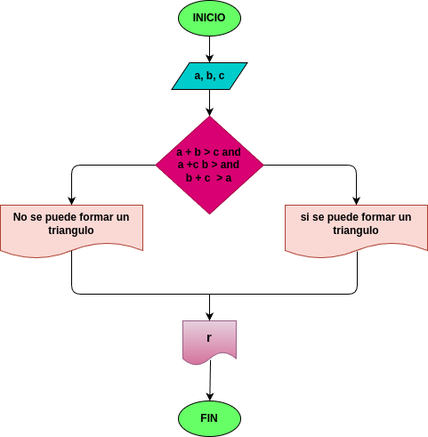

# Quiz instrucciones condicionales

### Realice el análisis, diseño y construcción para resolver el siguiente problema:

Dados tres números a, b y c, correspondientes a la longitud de los lados de una figura geométrica, determinar si pueden formar los lados de un triángulo.

## input

### variables de entrada
a: longitud del primer lado del triangulo

b: longitud del segundo lado del triangulo

c: longitud del tercer lado del triangulo

### processing
resultado: derterminar si los valores ingresados pueeden formar un triangulo

Reglas de validacion:
Si se cumplen las siguientes condiciones simultaneamente:
- a + b > c
- a + c > b
- b + c > a

Entonces, los valores ingresados puededn formar un triangulo.
De lo contrario, no se puede formr un triangulo

### output
Resultado: mensaje indicando si los valores forman un triangulo o no

### Diagrama de flujo
